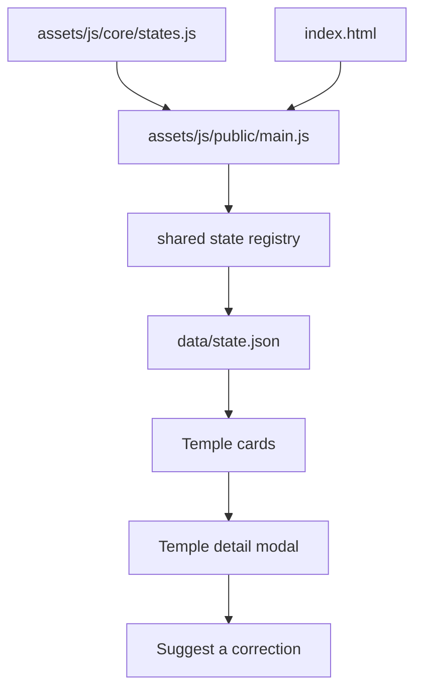
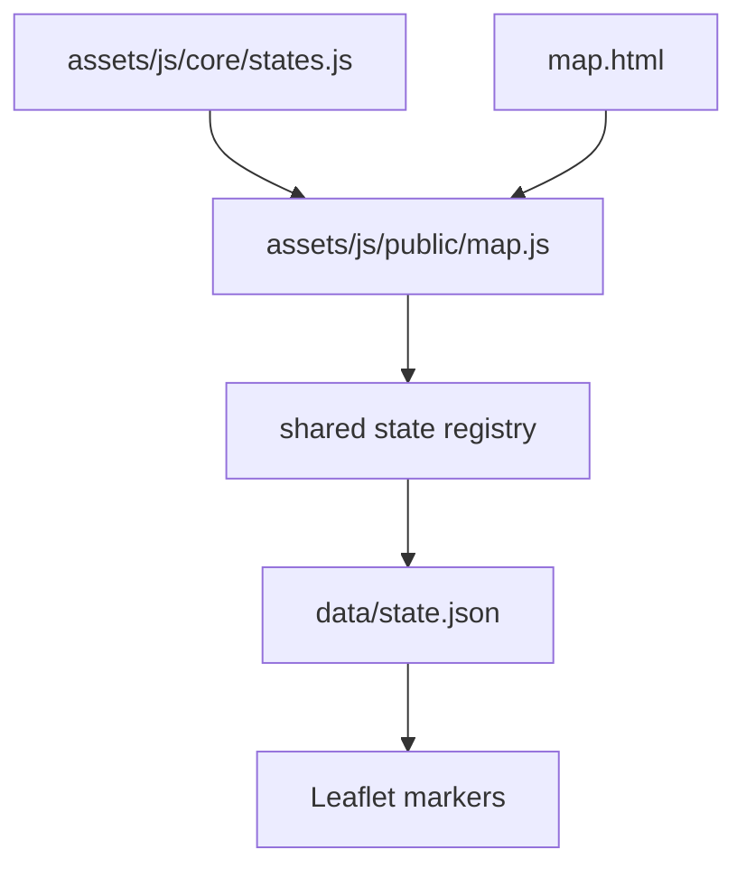
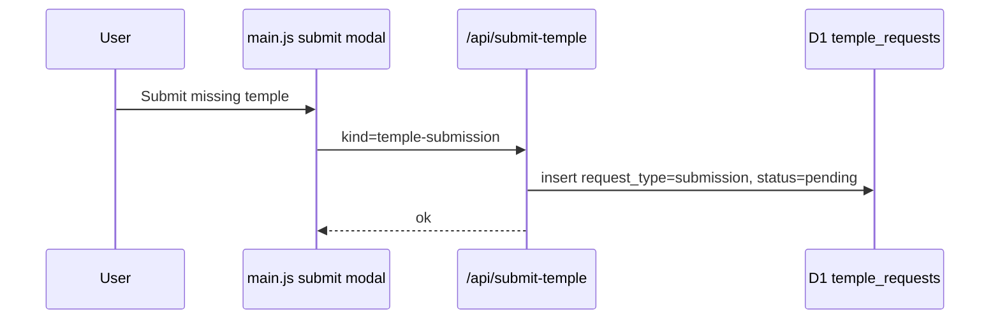
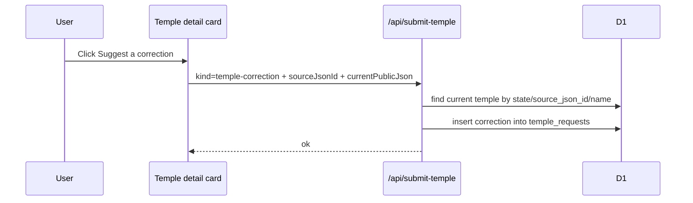
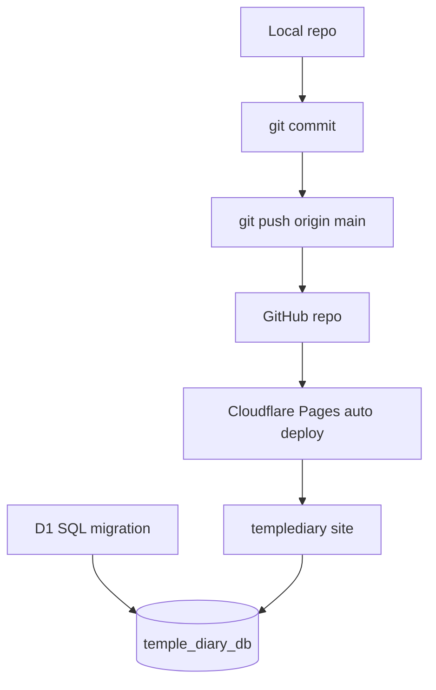
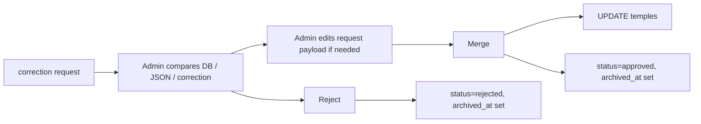

# TempleDiary Architecture

This document explains what data lives where, which files own each workflow, and how public temple listings, submissions, corrections, and admin review fit together.

## High-Level Model

TempleDiary uses a cheap public frontend with a separate D1-backed admin workflow.

```mermaid
flowchart LR
  Visitor[Public visitor] --> StaticJSON[data/*.json]
  StaticJSON --> PublicUI[index.html / assets/js/public/main.js / map.html / assets/js/public/map.js]

  Visitor --> SubmitUI[Submit / Correction modal]
  SubmitUI --> SubmitAPI[/api/submit-temple]
  SubmitAPI --> RequestTable[(D1 temple_requests)]

  Admin[Admin dashboard] --> TemplesAPI[/api/temples]
  Admin --> StatesAPI[/api/temple-states]
  Admin --> RequestsAPI[/api/temple-requests]
  TemplesAPI --> TemplesTable[(D1 temples)]
  StatesAPI --> TemplesTable
  RequestsAPI --> RequestTable

  Admin --> RequestActions[edit / approve / merge / reject requests]
  RequestActions --> TemplesTable
  RequestActions --> RequestTable
```

## Data Stores

### Static JSON

Location:

```text
data/*.json
```

Purpose:

- Fast public listing data.
- Used by the current public homepage and map.
- Cheap because Cloudflare can cache static files.

Used by:

```text
assets/js/public/main.js
assets/js/public/map.js
assets/js/core/states.js
dashboard.html JSON editor section
```

Current behavior:

- Public users still see temples from JSON.
- JSON is not automatically rewritten when D1 changes.
- The admin dashboard can export approved D1 records as a bundle.
- `scripts/split-d1-export-bundle.mjs` splits that bundle back into `data/*.json`
  for the public site publishing step.

### D1: `temple_diary_db`

Cloudflare Pages binding name expected by code:

```text
DB
```

Main tables:

```text
temples
temple_requests
```

Old community voting has been dropped; `temple_verifications` is obsolete and should not be recreated.

## D1 Table Responsibilities

### `temples`

Canonical temple records.

Used for:

- Admin D1 view.
- Current full database of imported temples.
- Future public D1 reads if the site moves away from static JSON.
- Approved community submissions after admin action.
- Merged corrections after admin action.

Important fields:

```text
id                 D1 primary id
source_json_id     original JSON id from data/*.json
state              kerala, tamil-nadu, karnataka, etc.
name               temple name
deity              main deity
district           district
location           address / locality
lat, lng           coordinates
admin_label        display/trust label, typed by admin
status             verified, unverified, removed, needs_review
raw_json           original imported or submitted source blob
```

Current status meaning:

```text
unverified   visible/listed, but not personally admin verified
verified     visible/listed and admin verified
removed      hidden from future public use
needs_review admin needs to inspect before trusting
```

Current label meaning:

```text
COMMUNITY           imported/community source, visible but not admin verified
ADMIN VERIFIED      admin personally verified
COMMUNITY SUBMITTED approved community submission
COMMUNITY CORRECTED record updated from accepted correction
```

The label is flexible. Admin can type other labels later.

### `temple_requests`

Queue of community requests.

Used for:

- New temple submissions.
- Corrections to existing temples.
- Deletion requests.
- Approved/rejected archive.

Important fields:

```text
id                   UUID
request_type         submission, correction, deletion
status               pending, approved, rejected, needs_review
state                state key
temple_id            matched D1 temple id if known; used for corrections/deletions
source_json_id       matched static JSON id if known; fallback for old JSON-sourced records
admin_label          default label proposed for the request
submitted_by         community submitter name
submitter_email      optional
payload_json         community request, editable by admin before approval
current_db_json      snapshot of current D1 record at request time
current_public_json  snapshot of public JSON record at request time
decided_by           admin action actor
decided_at           admin action timestamp
archived_at          archive timestamp for approved/rejected requests
```

Request statuses:

```text
pending       waiting for admin decision
needs_review  admin has flagged for later review
approved      accepted and archived
rejected      rejected and archived
```

## Public Frontend

Main public files:

```text
index.html
assets/js/public/main.js
map.html
assets/js/public/map.js
assets/css/style.css
assets/js/public/submit-location.js
assets/js/admin/dashboard.js
assets/js/core/states.js
```

### Homepage Listing



Owned by:

```text
assets/js/public/main.js
```

Current data source:

```text
data/*.json
```

### Map



Owned by:

```text
assets/js/public/map.js
```

Current data source:

```text
data/*.json
```

## Submission And Correction Intake

Primary endpoint:

```text
POST /api/submit-temple
```

File:

```text
functions/api/submit-temple.js
```

Accepted request kinds:

```text
temple-submission -> request_type=submission
temple-correction -> request_type=correction
temple-deletion   -> request_type=deletion
```

### New Temple Submission



Current behavior:

- New submissions are stored as pending requests.
- They are not inserted into `temples` automatically at submission time.
- Admin can edit the submitted fields before approval.
- Approval inserts a new row into `temples` for the submitted state.

### Correction Request



Stored snapshots:

```text
payload_json         user's submitted correction
current_db_json      matching D1 record if found
current_public_json  JSON record shown to user
```

This supports the admin comparison view:

```text
Current DB | Current Public JSON | Submitted Correction
```

### Deletion Request

Deletion requests use the same table:

```text
request_type=deletion
status=pending
```

Admin accept behavior:

```text
UPDATE temples SET status='removed' WHERE id = ?
```

Avoid hard deletion unless there is a strong reason.

## Admin Dashboard

File:

```text
dashboard.html
```

Current sections:

```text
Overview       static JSON summary
Temples        static JSON editor
D1 Records     canonical DB records from /api/temples
State list     D1 state discovery from /api/temple-states
Requests       editable pending/archive request queue from /api/temple-requests
Add / Edit     local JSON editor
States         local state config editor
Import         JSON import
Export         JSON export
Health         JSON health checks
```

### D1 Records Tab

State discovery endpoint:

```text
GET /api/temple-states
```

Endpoint:

```text
GET /api/temples?state=kerala&include=all
```

File:

```text
functions/api/temples.js
functions/api/temple-states.js
```

Purpose:

- Discover the admin state list from D1, then merge it with static display metadata.
- Show canonical D1 records.
- Filter by status.
- Confirm `admin_label`.

### Requests Tab

Endpoint:

```text
GET /api/temple-requests?state=kerala&type=correction&status=pending
```

File:

```text
functions/api/temple-requests.js
```

Purpose:

- View pending submissions.
- View pending corrections.
- View pending deletion requests.
- Edit submitted temple fields before approval.
- Approve submissions into new D1 `temples` rows.
- Merge corrections into existing D1 `temples` rows.
- Mark deletion requests as `removed` in D1.
- View approved/rejected archives.

For submissions, the request editor hides matching fields because approval creates
a new D1 row. For corrections and deletions, the editor exposes matching fields:

```text
D1 Temple ID     strongest match; updates/removes that exact D1 row
Source JSON ID   fallback for records imported from data/*.json
state + name     final fallback when ids are missing
```

Admins can use the `update` action to save edited request payloads before deciding,
or approve/merge directly with an edited payload override.

## API Reference

### `GET /api/temples`

Returns D1 temple records.

Query params:

```text
state=kerala
include=public | all
```

Default `include=public` returns:

```text
verified + unverified
```

`include=all` returns:

```text
verified + unverified + needs_review + removed
```

### `POST /api/submit-temple`

Receives submission/correction/deletion requests.

Important payload fields:

```text
kind                temple-submission | temple-correction | temple-deletion
State               state key
Temple              temple name
Submitted By        required
Submitter Email     optional
Admin Label         optional proposed label
Source JSON ID      correction source id
Current Public JSON correction snapshot
```

### `GET /api/temple-requests`

Returns request queue rows.

Query params:

```text
state=kerala
type=submission | correction | deletion
status=pending | needs_review | approved | rejected
limit=100
```

Optional security:

If `ADMIN_API_TOKEN` is set in Cloudflare Pages environment variables, this endpoint requires either:

```text
x-admin-token: <token>
```

or:

```text
?token=<token>
```

### `POST /api/temple-requests`

Updates or decides request queue rows. Requires admin auth.

Actions:

```text
update        save edited payload_json/admin_label without approving
approve       approve submission or merge correction
needs_review  save for later review
reject        archive as rejected
```

For `approve`, request behavior depends on `request_type`:

```text
submission -> INSERT INTO temples
correction -> UPDATE matching temples row
deletion   -> UPDATE matching temples row SET status='removed'
```

The request body may include `payloadOverride`; when present, approval uses that
edited payload instead of the originally submitted `payload_json`.

## Deployment Flow



Normal deploy:

```bash
git add .
git commit -m "Describe change"
git push origin main
```

Cloudflare Pages deploys automatically if the Pages project is connected to GitHub and `main` is the production branch.

## Existing D1 Migration

For an existing DB created from the old schema, this migration was required:

```text
scripts/d1/add-request-workflow.sql
```

It adds:

```text
temples.admin_label
temple_requests
request indexes
```

All existing records were also labeled:

```sql
UPDATE temples
SET admin_label = 'COMMUNITY'
WHERE admin_label IS NULL OR admin_label = '';
```

## Request Workflow And Publishing

### Admin Merge Correction

Current behavior:



### Approve Submission

Current behavior:

```text
pending submission -> INSERT INTO temples -> request status approved
```

Default label:

```text
COMMUNITY SUBMITTED
```

### Publish To Static JSON

Current public frontend uses JSON.

Preferred publishing flow:

```text
Dashboard JSON Export -> Download D1 all-state bundle
node scripts/split-d1-export-bundle.mjs <bundle.json> --write
review git diff data/
commit and deploy
```

Other later option:

```text
switch public frontend to /api/temples with caching
```

For lowest cost, keeping public JSON and publishing D1 exports remains preferred.


======================================NOTES============================
  5. If output looks correct, write into data/*.json:

  node scripts/split-d1-export-bundle.mjs templediary-d1-export-2026-06-01.json
  --write

  For only one state:

  node scripts/split-d1-export-bundle.mjs templediary-d1-export-2026-06-01.json
  --write --states kerala

  That updates the public data/<state>.json files from the D1 export. Then
  review git diff data/ before committing.
